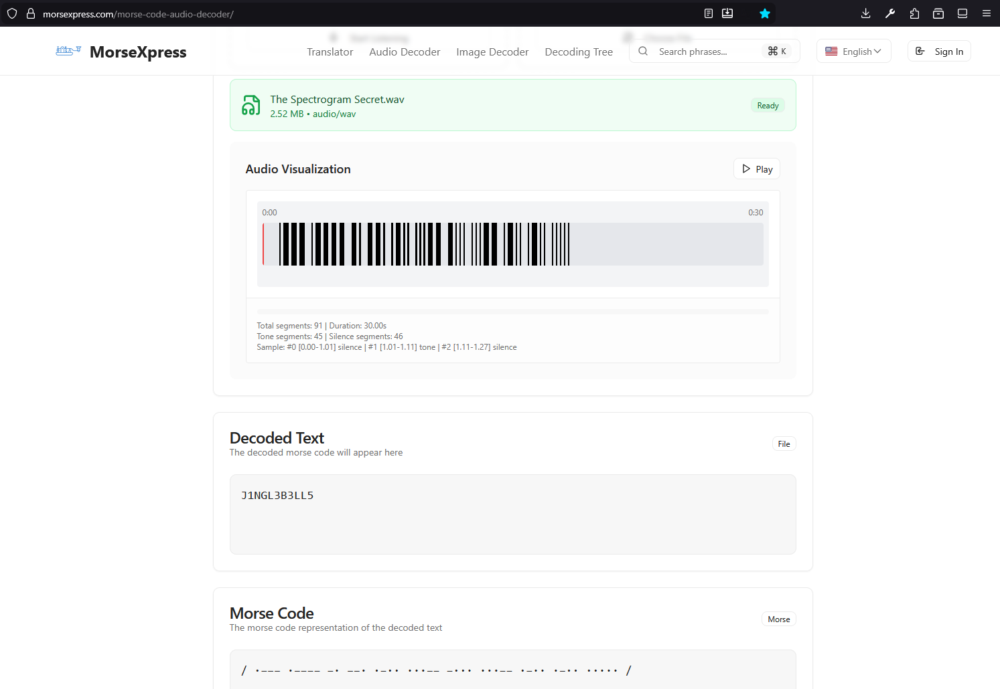

# The Spectrogram Secret

Basic challenge details:
- Difficulty: Easy
- Points: 50 (static)
- Resources: Click Here
- Hints: None

Challenge Description: Santa's enjoying a quiet beach Christmas when a strange holiday tune washes ashore. It sounds ordinary - maybe even peaceful - but something feels off beneath the surface. The ocean hums, the air crackles, and a secret rides the sound itself. Listen closely, trust your instincts, and see what this festive waveform is really saying.

Made and submitted by: Rashmi Ramanayake on behalf of Legion Offensive Security

## Writeup

### Step 1

Open the provided file `The Spectrogram Secret.wav` in Audacity. Switch the track view to "Spectrogram" from the default "Waveform". This reveals frequency content over time instead of amplitude.


The brighter bots and longer dashes reveals morse code. You can then attempt to transcribe them manually.

Or you can use an (online) automated morse code decoding tool. Below is a screenshot of [MorseXpress](https://morsexpress.com/morse-code-audio-decoder/) that managed to decode it perfectly.



This should decode to `J1NGL3B3LL5`.

### Step 2

Surprisingly, there is another step. You need to extract the hidden data using `steghide` and `J1NGL3B3LL5` as the password from our audio file.

```bash
$ steghide extract -sf The_Spectrogram_Secret.wav -p J1NGL3B3LL5
wrote extracted data to "flag.txt".

$ cat flag.txt
AUCTF{84ed575ea49bef3d3c8499f149f2ebfe}
```

By revealing the Morse code in the spectrogram and using it as the steghide password, the hidden flag was successfully extracted.

Flag: `AUCTF{84ed575ea49bef3d3c8499f149f2ebfe}`

