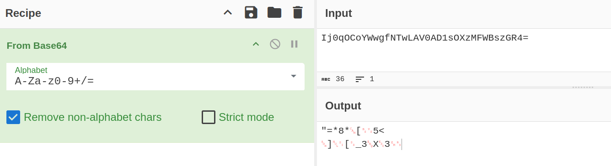
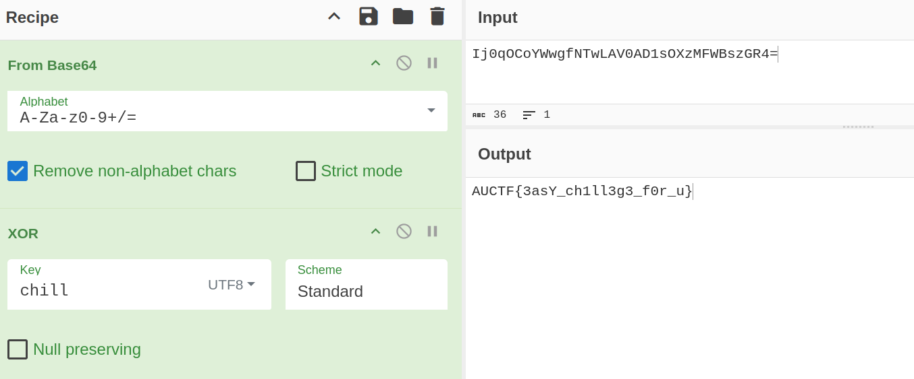

# ChillXOR

Basic challenge details:
- **Difficulty**: Easy
- **Points**: 150 (static)
- **Resources**: Click Here
- **Hints**: 1

**Challenge Description**: While Santa's chilling by the beach, you come across a short string that looks like pure holiday gibberish. It turns out it's been base64-encoded after being XOR’d with a short English word - wrapped up like a sneaky Christmas gift

**Hint**:

Listen up, recruit. During a covert interception mission, our cyber-intel unit captured an encrypted transmission from an enemy communications relay. The message looks harmless - just a short string of gibberish - but command believes it hides a crucial access flag.

Our analysts discovered traces of Base64 encoding layered over an XOR cipher, encrypted with a short five-letter English word - one that means relax.

Your mission is simple: Decode the message, reveal the hidden flag, and report back to command.

**Made and submitted by**: Wooshan Gamage on behalf of Legion Offensive Security

## Writeup

Decoding this from base64 gives raw bytes.

The hint reveals that this has been XOR'd with a 5 character long english word which is also a synonym for "relax". The word is "chill". XOR-ing this with the "Key" set to "chill" of "UTF8" and the "Scheme" set to "Standard" will return the flag.

Flag: `AUCTF{3asY_ch1ll3g3_f0r_u}`
