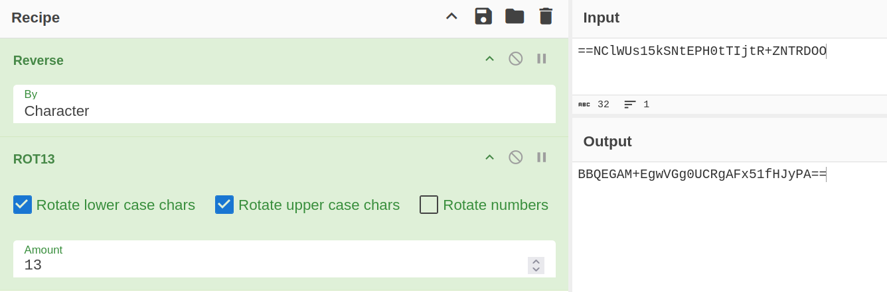

# Echoes in the Snow

Basic challenge details:
- **Difficulty**: Hard
- **Points**: 250 (static)
- **Resources**: Click Here
- **Hints**:1

**Challenge Description**: At 04:13, while Santa's enjoying a beach sunrise, a recon UAV caught a brief holiday directive from a forward post. Before it reached HQ, a frantic maintenance script scrambled it in three festive layers and archived the result. The artifact is short - just one `AUCTF{…}` order. Recover it fast… the relay buffer rots away like snow in the sun.

**Hint**: Enemy used a quick field-scramble: undo the recorder’s scrambling, unwrap the alphabet camouflage, decode the payload, then hunt the repeated bird-code with a short five-letter key - crib the standard flag header to confirm

**Made and submitted by**:

## Writeup

Given in the challenge resources is this string: `==NClWUs15kSNtEPH0tTIjtR+ZNTRDOO`.



This CyberChef recipe gives us a valid base64 string. The python script below deciphers the flag.

```python
import base64

# 1) the Base64 string after reversing + ROT13 stage
b64 = "BBQEGAM+EgwVGg0UCRgAFx51fHJyPA=="

# 2) decode to raw bytes (this is your 'cipher' bytes)
cipher = base64.b64decode(b64)
print("cipher bytes:", cipher.hex())

# 3) crib (known prefix of the flag)
crib = b"AUCTF" # exactly 5 bytes, matches the 5-byte key length

# 4) compute key bytes using the crib
key_bytes = bytes([cipher[i] ^ crib[i] for i in range(len(crib))])
print("key bytes (hex):", key_bytes.hex())
print("key bytes (ascii):", key_bytes.decode('ascii', errors='replace'))

# 5) use recovered key to decrypt entire ciphertext
key = key_bytes
plain = bytes([cipher[i] ^ key[i % len(key)] for i in range(len(cipher))])
print(plain.decode())
```

Executing the above script gives this output:

```
$ python ./solve.py

cipher bytes: 04140418033e120c151a0d14091800171e757c72723c
key bytes (hex): 4541474c45
key bytes (ascii): EAGLE
AUCTF{SKY_HUNTER_2077}
```

Flag: `AUCTF{SKY_HUNTER_2077}`
