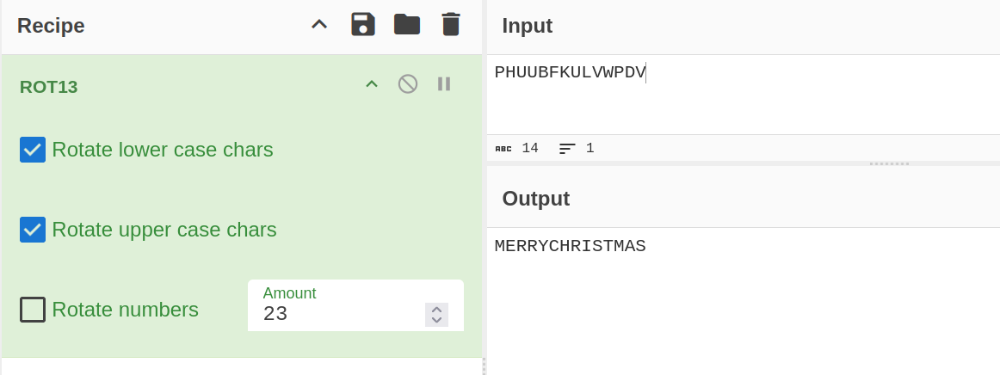
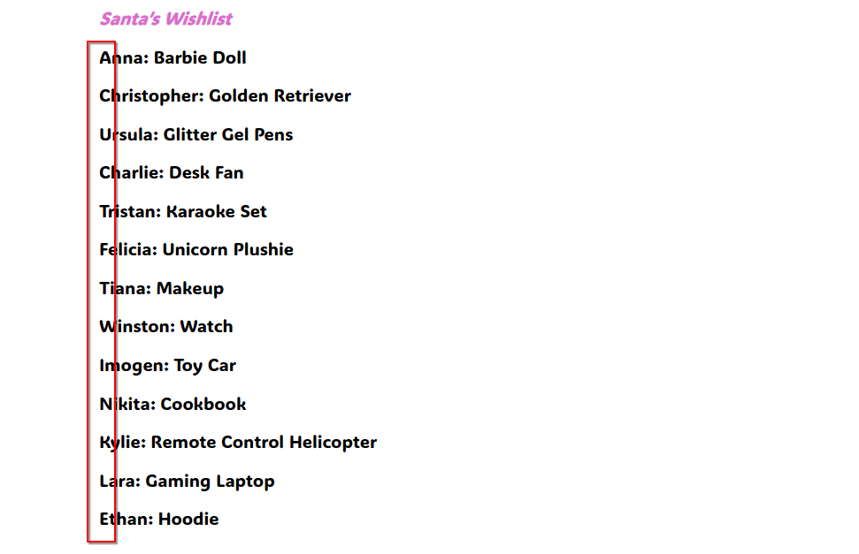

# Fa-La-La-La-Flag

Basic challenge details:
- **Difficulty**: Easy
- **Points**: 50 (static)
- **Resources**: Click Here
- **Hints**: None

**Challenge Description**: Santa has a Wishlist document filled with wishes from children's letters he collected from the mailbox. However, the mischievous elves felt cheeky and decided to encode the word using a shift cipher. Decode it to reveal the secret flag hidden in the Wishlist.

**Author**: Kat Ho

## Writeup

Given are a PDF file and the string: `PHUUBFKULVWPDV`. The PDF file is locked with a password.

Performing a ROT13 with the "Amount" set to 23 turns `PHUUBFKULVWPDV` into `MERRYCHRISTMAS`.

This can then be used to unlock the PDF. The very first letters of each line gives us the flag.

Flag: `AUCTF{TWINKLE}`

