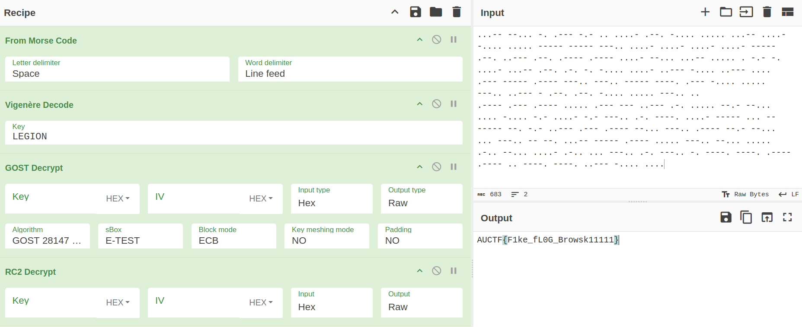

# MorseBro

Basic challenge details:
- **Difficulty**: Medium
- **Points**: 225 (static)
- **Resources**: Click Here
- **Hints**:1

**Challenge Description**: Santa's beach radio crackles to life with a strange holiday transmission. It sounds festive, rhythmic, and oddly layered - like a message wrapped, unwrapped, then wrapped again. Somewhere beneath the dots, waves, and winter static lies something meant to stay hidden. Tune in carefully, peel back what you hear, and see what secret this sun-soaked signal is guarding.

**Hint**:

The intercepted radio log came with a torn notebook stamped with the insignia “LEGION” - Latin for legion. Inside, you find a cryptic passage written in uneven ink:

"The legion never speaks plainly. Its words are first echoed in light and shadow - a dance of dots and dashes. Then comes the oath of five, the sacred name they march under - LEGION - whispered through shifting alphabets. Beyond that lies the steel wall forged in 1989, where logic meets cold precision. Only after breaching the Soviet gate does the old Western cipher bow, revealing the legion’s secret truth."

No algorithm names, no numbers - yet the sequence feels deliberate. If you follow LEGION’s march, each line may be a key to the next.

**Made and submitted by**: Wooshan Gamage on behalf of Legion Offensive Security

## Writeup

Given in the hint is a special word "`LEGION`" - who is also a partner of this CTF. This is the key that has to be used for the Vigenere Decode function.

The above recipe deciphers the flag: `AUCTF{F1ke_fL0G_Browsk11111}`
