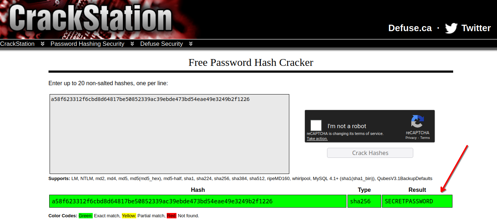

# Santa's Cracked Christmas

Basic challenge details:
- **Difficulty**: Easy
- **Points**: 70 (static)
- **Resources**: Click Here
- **Hints**: 1

**Challenge Description**: Santa has been targeted by naughty kids trying to hack his secrets, so he has started storing them as hashes. However, the kids discovered Santa’s hashed password. Figure out what password Santa used by reversing the hash.

**Hint**: Santa’s favourite hashing library in Python is hashlib, but the kids didn’t even need Python to break it. Maybe they looked it up somewhere?

**Author**: Kat Ho

## Writeup

> Given string: `a58f623312f6cbd8d64817be50852339ac39ebde473bd54eae49e3249b2f1226`

This is a string with 64 hexadecimal characters, which takes 256 bits. Therefore, it is safe to assume this is a SHA-256 hash. [CrackStation](https://crackstation.net/) was able to crack this.

Flag: `AUCTF{SECRETPASSWORD}`
