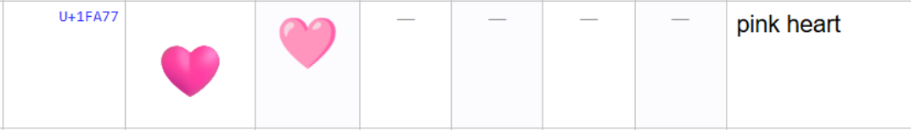
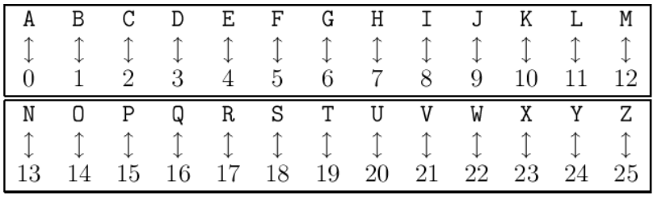
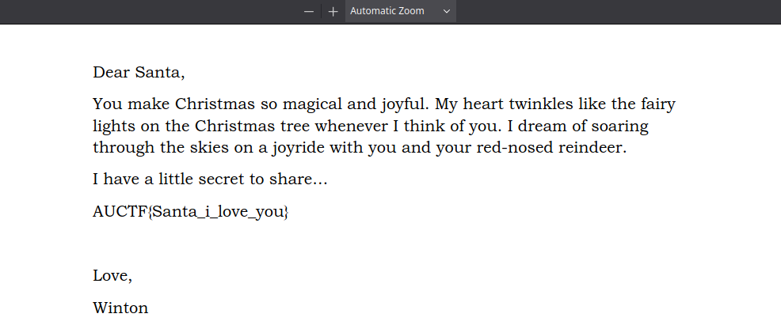

# Santa’s Love Letter

Basic challenge details:
- **Difficulty**: Easy
- **Points**: 50 (static)
- **Resources**: Click Here
- **Hints**: 1

**Challenge Description**: One of the elves has a secret crush on Santa and slipped a love letter into the mail sack. To keep it hidden, she encrypted it by mapping letters to numbers, using the Unicode value of her favourite colour heart emoji. Can you figure out the Unicode and unlock her heartfelt message?

**Hint**: Look at the Unicode of U+1FA77, to unlock the message. The encryption involves mapping letters to numbers (A=0, B=1,…), so think about how that might work!

**Author**: Kat Ho

## Writeup

Attempting to open the given PDF file requests for a password.


Taking a look at the hint mentioned the unicode character: `U+1FA77`.



The hint also mentions an encoding scheme.



Using this simple encoding scheme, we can match every individual character. As it mentions nothing about numbers or special characters, we will leave 

```
U+1FA77

U --> 20
+ --> +
1 --> 1
F --> 5
A --> 0
7 --> 7
7 --> 7
```

This gives us: `20+15077`. Attempting to unlock the PDF using this as the password reveals the flag.



Flag: `AUCTF{Santa_i_love_you}`
