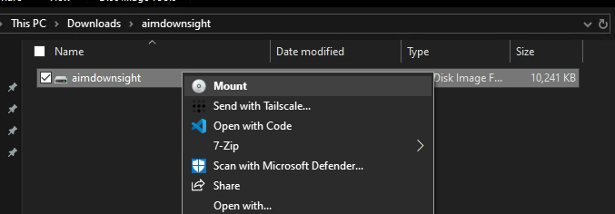

# Aim Down Sight

Basic challenge details:
- **Difficulty**: Easy
- **Points**: 125 (static)
- **Resources**: Click Here
- **Hints**:None

**Challenge Description**: Look really hard and you will find the answer in a stream.

**Author**: Long Hoàng Đỗ

## Writeup

Mount the `.vhd` file in Windows.



Open powershell from within the mounted volume and inspect all the streams of the only file that's available. 

```powershell
PS D:\> Get-Item '.\Brain breaks.docx' -stream *


PSPath        : Microsoft.PowerShell.Core\FileSystem::D:\Brain breaks.docx::$DATA
PSParentPath  : Microsoft.PowerShell.Core\FileSystem::D:\
PSChildName   : Brain breaks.docx::$DATA
PSDrive       : D
PSProvider    : Microsoft.PowerShell.Core\FileSystem
PSIsContainer : False
FileName      : D:\Brain breaks.docx
Stream        : :$DATA
Length        : 107216

PSPath        : Microsoft.PowerShell.Core\FileSystem::D:\Brain breaks.docx:ADS
PSParentPath  : Microsoft.PowerShell.Core\FileSystem::D:\
PSChildName   : Brain breaks.docx:ADS
PSDrive       : D
PSProvider    : Microsoft.PowerShell.Core\FileSystem
PSIsContainer : False
FileName      : D:\Brain breaks.docx
Stream        : ADS
Length        : 33

PSPath        : Microsoft.PowerShell.Core\FileSystem::D:\Brain breaks.docx:Zone.Identifier
PSParentPath  : Microsoft.PowerShell.Core\FileSystem::D:\
PSChildName   : Brain breaks.docx:Zone.Identifier
PSDrive       : D
PSProvider    : Microsoft.PowerShell.Core\FileSystem
PSIsContainer : False
FileName      : D:\Brain breaks.docx
Stream        : Zone.Identifier
Length        : 60
```

Get the content of the stream named `ADS`.

```powershell
PS D:\> Get-Content '.\Brain breaks.docx' -Stream ADS
AUCTF{what_3lse_could_AD5_m3an}
```

Flag: `AUCTF{what_3lse_could_AD5_m3an}`
