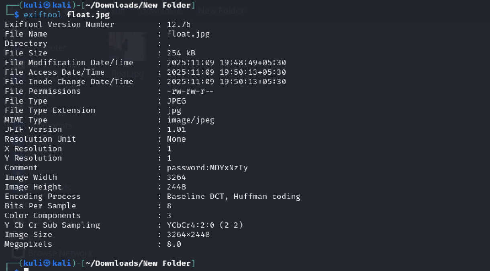
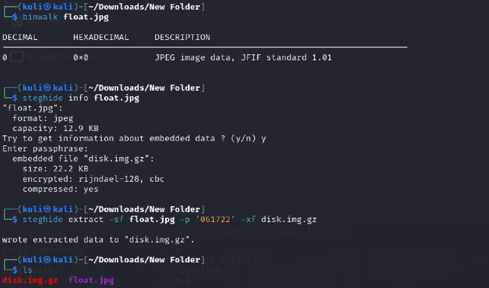
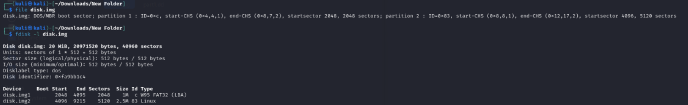
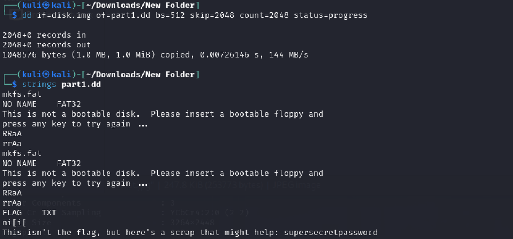
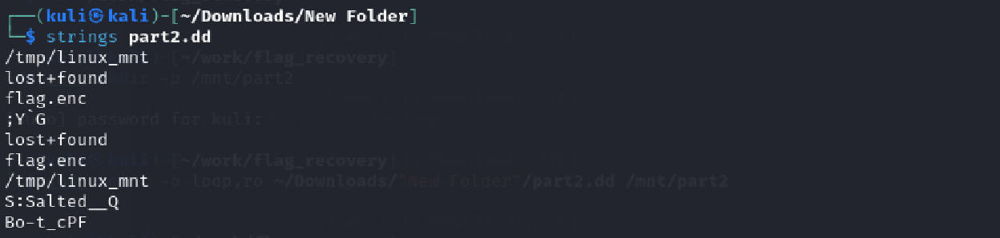
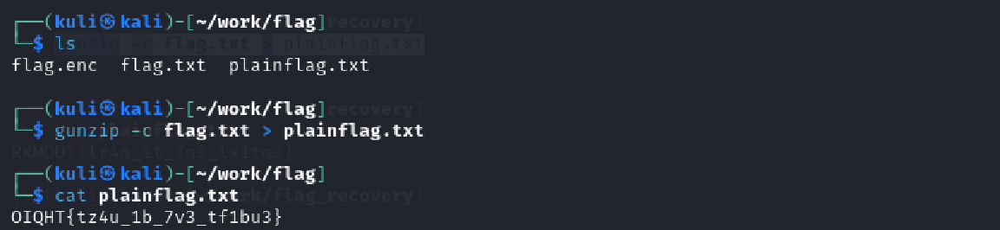

# False Positive

Basic challenge details:
- **Difficulty**: Hard
- **Points**: 400 (static)
- **Resources**: Click Here
- **Hints**: None

**Challenge Description**: Santa's beach postcard looks picture-perfect - sunshine, smiles, and festive cheer all around. But not everything is as simple as it seems. Beneath the glossy surface, something feels a little heavier than sand. Take a closer look, trust your curiosity, and see what secrets might be hiding where no one thought to look during the holiday rush.

**Made and submitted by**: Amindya Wijesinghe on behalf of Legion Offensive Security

## Writeup

Begin by inspecting the provided image and embedded data to determine type and any hints (metadata, stego info, signatures). This tells you the tools and passphrases to try next.

Exiftool reveals a comment tag containing `password:MDYxNzIy` that is base64 encoded. `MDYxNzIy` decodes to `061722`.

The image was scanned using binwalk to detect any appended or hidden files. Although binwalk did not reveal obvious embedded data, the presence of hidden content was confirmed with steghide. Using the passphrase derived from the EXIF comment (061722), steghide extracted a compressed file disk.img.gz. The file was then decompressed with gunzip to produce a raw disk image (disk.img) for further analysis.

By analyzing disk.img using file and fdisk -l, two partitions were identified, a 1 MB FAT32 partition and a 2.5 MB Linux partition, allowing safe carving and targeted analysis.

Both partitions were isolated using dd to create part1.dd and `part2.dd` for offline examination without modifying the original image.

The command, strings part1.dd revealed a hint (“supersecretpassword”), while strings `part2.dd` exposed references to `/tmp/real_mnt` and flag.enc, indicating an OpenSSL - encrypted file.

A dedicated working directory (`~/work/flag`) was created for organized analysis. The Linux partition (`part2.dd`) was then mounted read-only to prevent data alteration, and flag.enc was safely copied from /mnt/lin into the working directory for decryption.

Using the discovered passphrase, flag.enc was decrypted via OpenSSL (AES-256-CBC with PBKDF2), producing a gzip-compressed output (flag.txt). Decompressing the output(file.txt) produced a Caesar-ciphered and applying the appropriate Caesar shift (12) revealed the final, readable flag.

Flag: `AUCTF{fl4g_1n_7h3_fr1ng3}`
