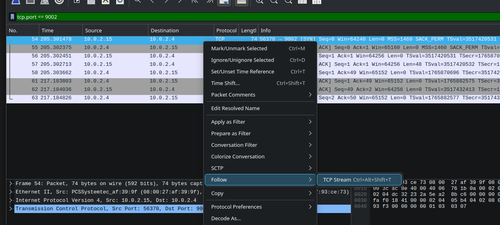
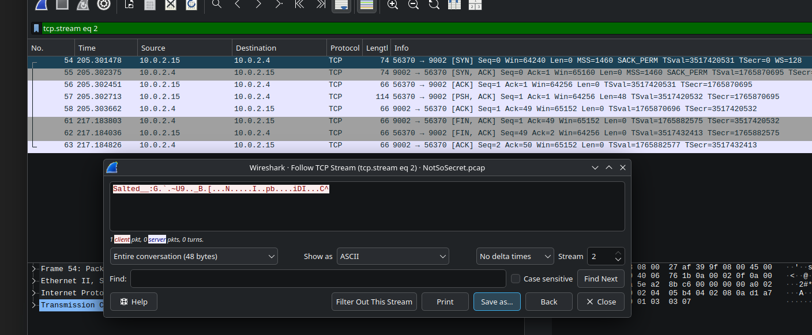

# Not So Secret

Basic challenge details:
- **Difficulty**: Easy
- **Points**: 100 (static)
- **Resources**: Click Here
- **Hints**:None

**Challenge Description**: Santa's enjoying a quiet beach Christmas, but somewhere in the festive network traffic, a "private" exchange didn't stay so private. Among the holiday chatter and digital waves, something valuable was sent and forgotten. Grab your sunnies, slow things down, and see what secrets washed ashore when no one thought anyone was listening.

**Made and submitted by**: Amindya Wijesinghe on behalf of Legion Offensive Security

## Writeup

The first step was to perform a quick overview of the file contents. Start by loading the PCAP into Wireshark and checking the overall statistics to get an initial understanding of the
captured traffic.

Findings:
- The statistics revealed multiple protocols, but most of the meaningful traffic was TCP.
- Looking at the Endpoints highlighted a few IPs (10.0.2.4, 10.0.2.15) that had significantly more traffic than others.
- Focusing on these endpoints suggested that they were involved in the main conversation flow and likely held the key data to investigate further.

Analyzing the TCP stream among the above-mentioned IPs revealed a dialogue hinted at a transferred file. A reference to OpenSSL pointed towards an encrypted file that needed decryption.


Since the challenge hint mentioned a file transfer through port 9002, I focused on that traffic by applying the filter `tcp.port == 9002`.

These results hinted that this could contain OpenSSL encrypted data as mentioned within the conversation we discovered earlier. 



Therefore, I saved the raw stream to a file.



Then I attempted decryption using OpenSSL. The process successfully created a new text file containing the decrypted message.

```
$ openssl des3 -d -salt -in file.des3 -out file.txt -k supersecretpassword123

$ cat file.txt
AUCTF{s4lt3d_5tr3am_unl0ck3d!}
```

Flag: `AUCTF{s4lt3d_5tr3am_unl0ck3d!}`
