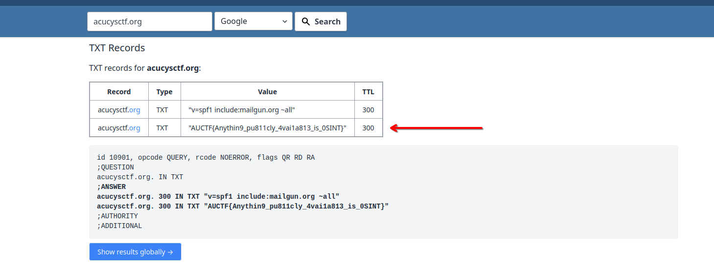

# Lookup ACUCyS

Basic challenge details:
- **Difficulty**: Easy
- **Points**: 75 (static)
- **Resources**: Click Here
- **Hints**: None

**Challenge Description**: Obviously we host this event on `jingleshells.acucysctf.org`. But really, lookup.

**Author**: Long Hoàng Đỗ

## Writeup

Use the DNS Lookup functionality of [WhatsMyDNS](https://www.whatsmydns.net/dns-lookup) or the `dig` command (from the `bind` package) to list all the DNS records of `acucysctf.org`.

The flag can be found in a TXT record at `@`: `AUCTF{Anythin9_pu811cly_4vai1a813_is_0SINT}`.

