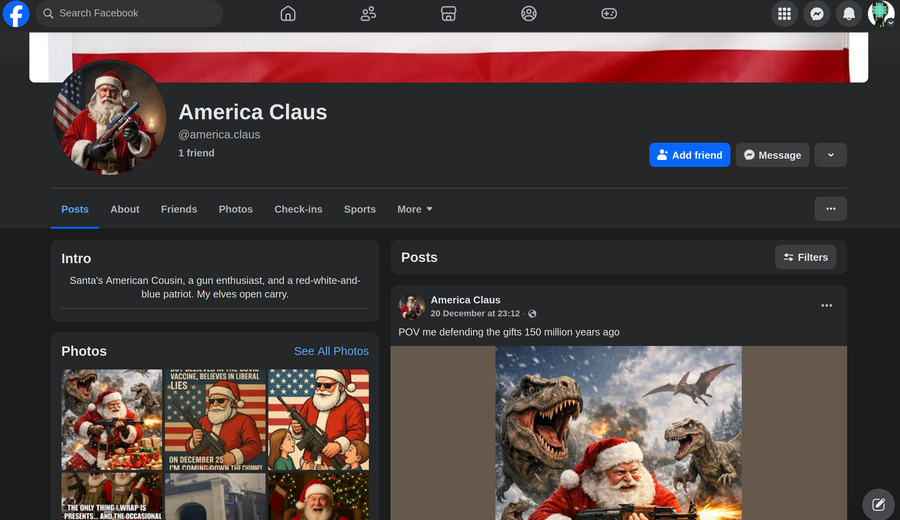
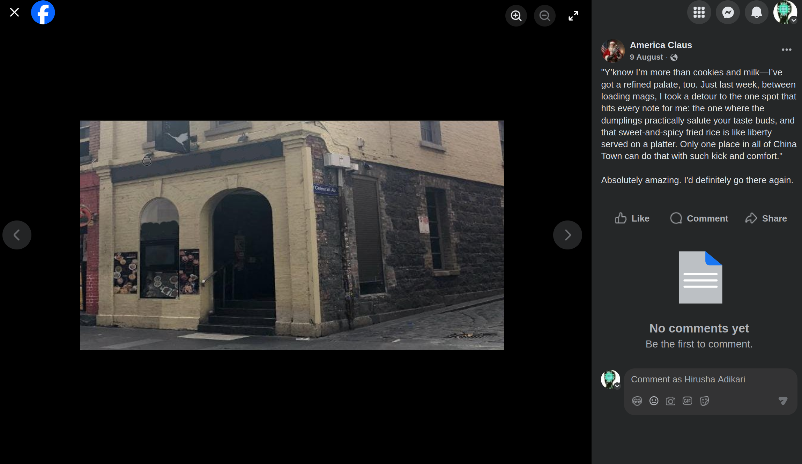

# Stars, Stripes, and Dumplings

Basic challenge details:
- **Difficulty**: Easy
- **Points**: 75 (static)
- **Resources**: Click Here
- **Hints**:2

**Challenge Description**: Santa’s red, white and blue cousin has been saying some crazy stuff lately. But he does swear by a really good restaurant. Can you find the name of this restaurant? FLAG FORMAT `AUCTF{Store_Name}`

**Hint 1**: He’s actually American!!

**Hint 2**: Auntie 'Europe Clause' has been having many stern chats with him - always telling him to get off that darn Facebook!!

Hint 3: He's part of the Melbourne Chess Collective

**Made and submitted by**: James Belcher Jr

## Writeup

The "red, white and blue" reference along with Hint 1 tells "America". Hint 2 tells that the auntie is "Europe Clause". Therefore, it's safe to assume that we are looking at "America Clause". Hint 2 also suggests that he is a facebook user. Searching for this name in Facebook gives us this profile:

This post can be found posted on his profile.

Reverse searching this image reveals it's name and location.

Flag: `AUCTF{The_Crane}`
