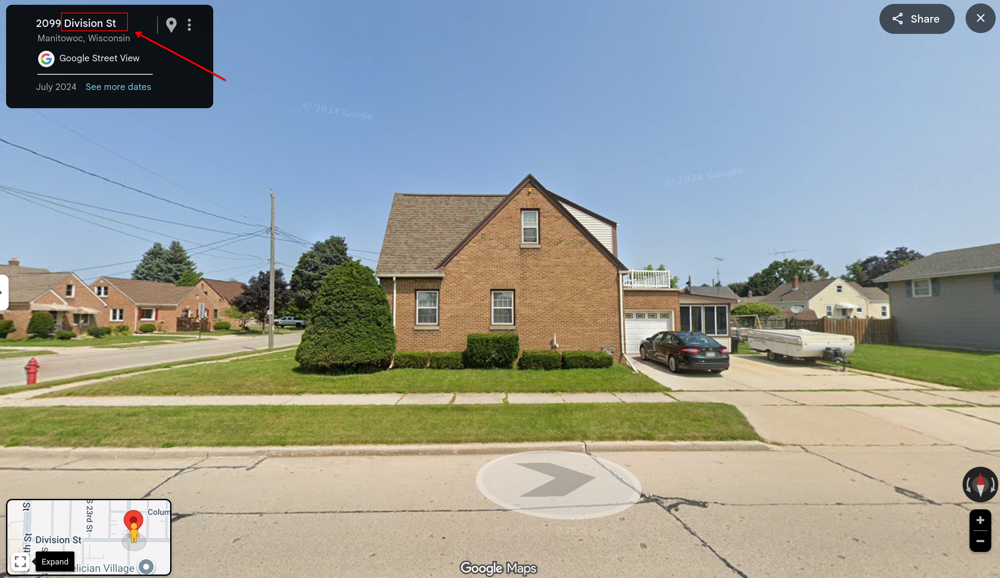

# The Case of the Hidden Corner

Basic challenge details:
- **Difficulty**: Hard
- **Points**: 350 (static)
- **Resources**: Click Here
- **Hints**:2

**Challenge Description**: Detective, it’s the most wonderful time of the year - but your latest case arrives like an unwrapped Christmas surprise. Inside the envelope is a single photograph: no note, no return address, just a snowy corner waiting to be placed on the map. Rumor says it's from a small lakeside city once known for shipbuilding, where winters bite hard and summers smell of fried curds. The streets run straight as if drawn by Santa himself. Somewhere nearby, a familiar daily rhythm hums beneath the holiday calm. Your mission is simple: pinpoint the exact intersection where the photo was taken.

**Hint 1**: Morning bells are where you went before comes to university.

**Hint 2**: You may go to the place where you can hear quiet footsteps, if you do something wrong.

**Made and submitted by**: Hiruna Perera on behalf of Legion Offensive Security

## Writeup

The description provided strong thematic hints:
- A lakeside city linked to shipbuilding and cheese curds → suggests Wisconsin.
- Harsh winters, fried curds, and county fairs → regional culture of Manitowoc.
- Morning bell and quiet hall footsteps → indirect hints toward a nearby middle school and a residential court.

The image was uploaded to picarta.ai, which suggested several possible nearby locations around Lake Michigan, including:
- Tulsa, OK (36.157345, -95.942474)
- Cleveland, TN (35.163376, -84.874180)
- Amherst, OH (41.401440, -82.215454)
- Waterloo, Canada (43.472454, -80.502050)
- Maplewood, Ferguson, and University City in Missouri
- South Euclid, OH

Although not exact, the clustering of suggestions near Lake Michigan and the Midwest supported the description’s subtle hints.

Focusing on Wisconsin, I searched neighborhoods around Manitowoc, WI, a city historically tied to shipbuilding and well-known for Wisconsin’s cheese curds.

Using Google Street View in Manitowoc, I located the exact house at: "1425 S 21st St, Manitowoc, WI 54220, USA"

Nearby, I confirmed the indirect description references:
- Washington Middle School (morning bell)
- Felician Village Court (quiet footsteps in a hall)

The house sits on a corner, and the intersecting street is Division St. Since the flag format is `AUCTF{street name}`, the final flag is: `AUCTF{Division_St}`
