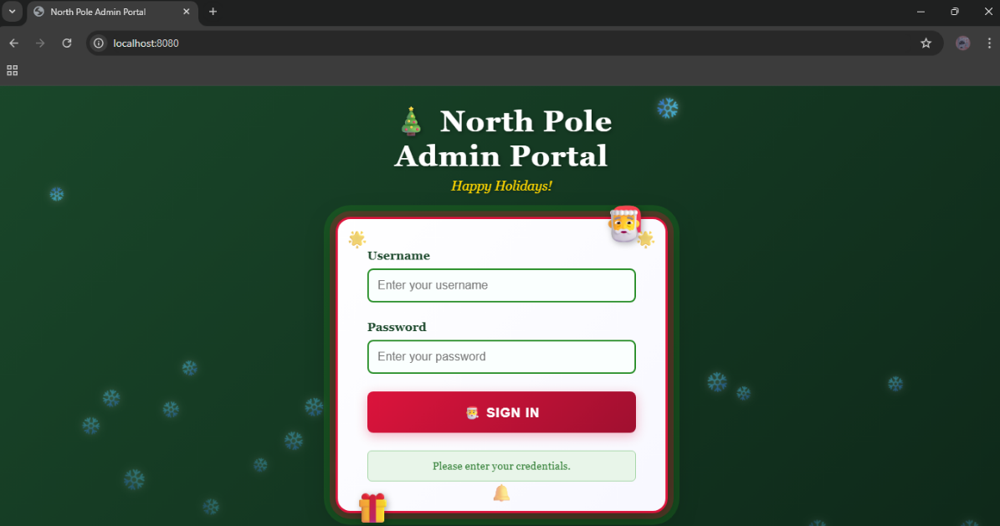
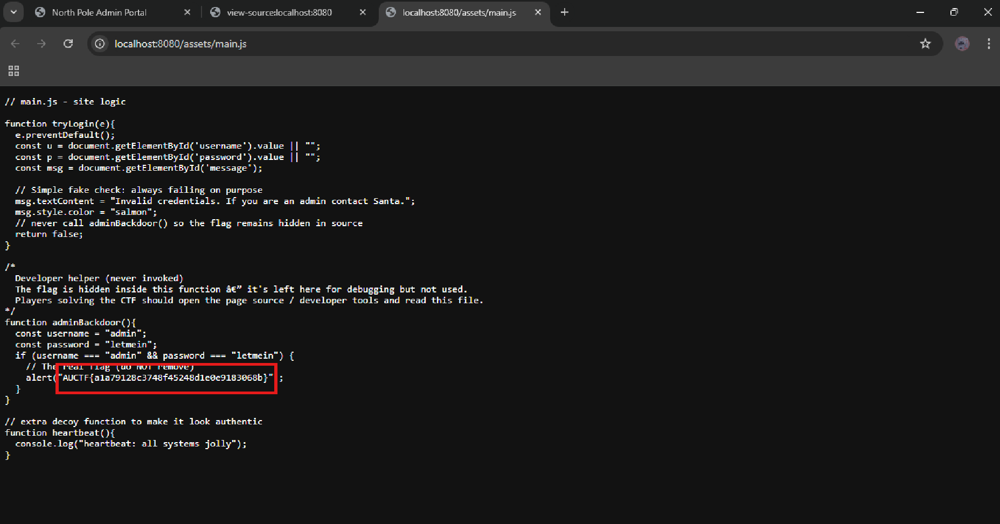

# North Pole Admin Portal

Basic challenge details:
- **Difficulty**: Easy
- **Points**: 50 (static)
- **Resources**: Click Here
- **Hints**: None

**Challenge Description**: Santa's swapped snow boots for flip-flops, but the North Pole admin portal is still running full steam. It looks festive, polished, and ready for Christmas - maybe a little too ready. Rumours say the elves rushed the launch before heading to the beach. Poke around and see what small holiday surprise might’ve been left behind.

**Made and submitted by**: Rashmi Ramanayake on behalf of Legion Offensive Security

## Writeup

Right-click on the page and select View page source

This shows the raw HTML served by the server. Scan it to find any `<script>` tags that reference external JS files.

Scroll through `assets/main.js` and look for:

Flag: `AUCTF{a1a79128c3748f45248d1e0e9183068b}`
